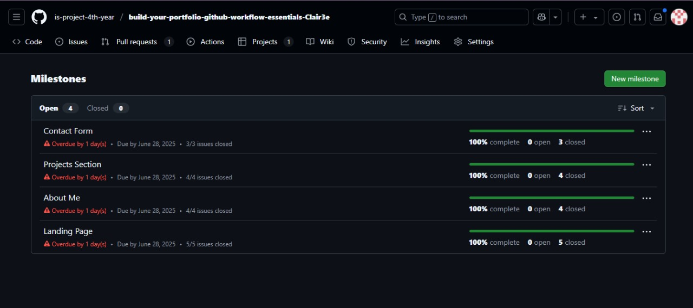
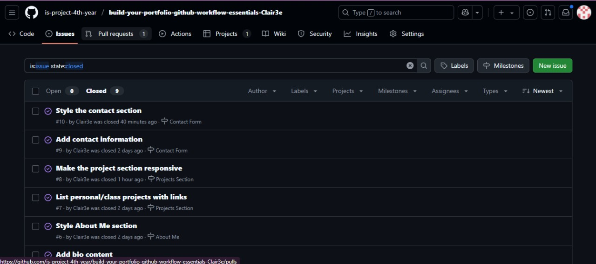
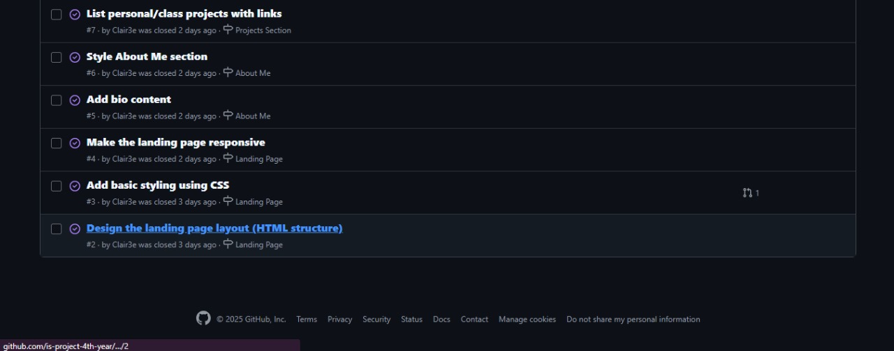
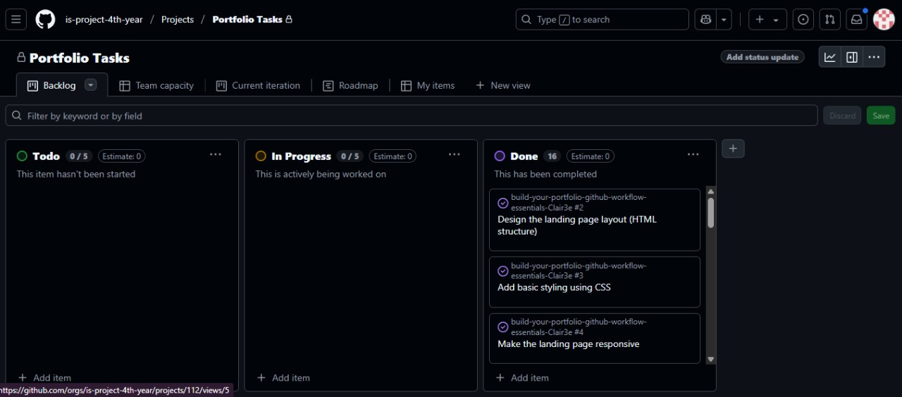
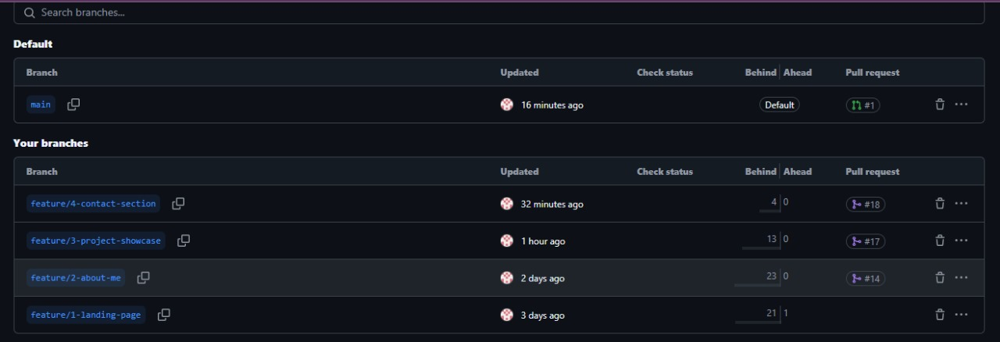
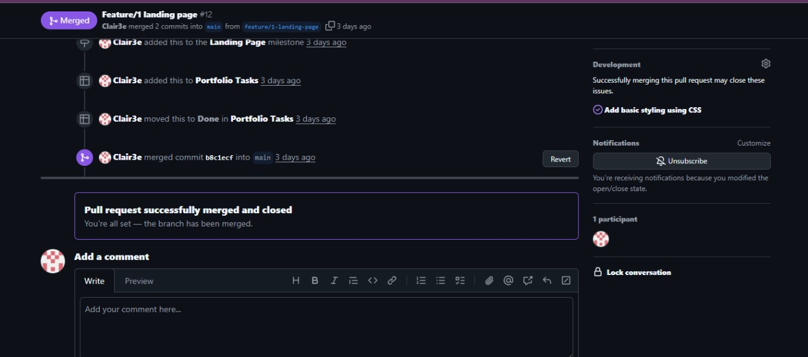
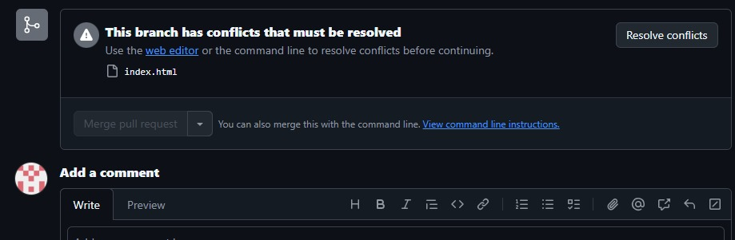
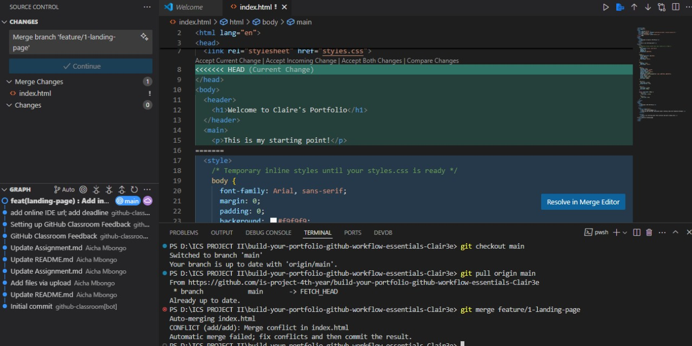
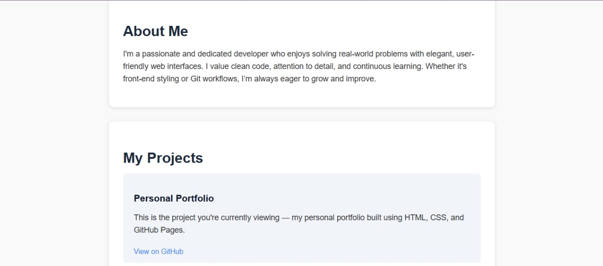
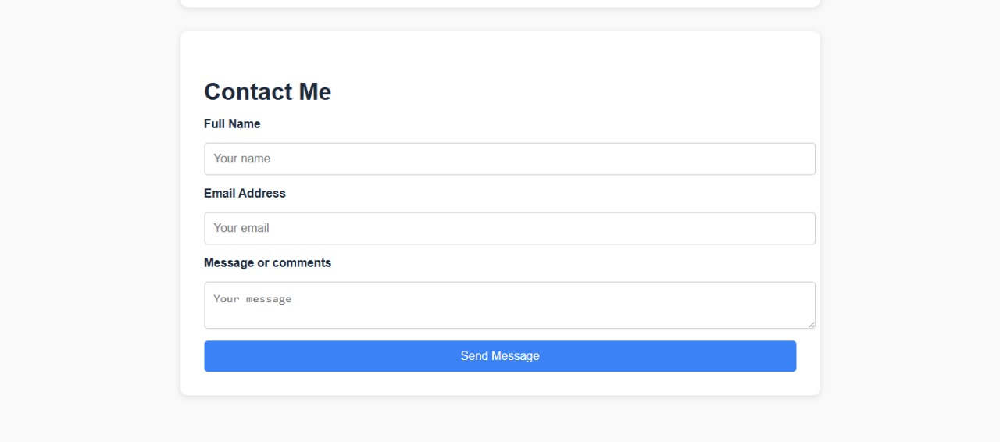

# 📄 Personal Portfolio Documentation

---

## 1. Student Details

- **Full Name**: Wang'ondu Claire Wambui  
- **Admission Number**: 151104  
- **GitHub Username**: Clair3e  
- **Email**: claire.wang'ondu@strathmore.edu  

---

## 2. Deployed Portfolio Link

🔗 **GitHub Pages URL**:  
[https://clair3e.github.io/build-your-portfolio-github-workflow-essentials-Clair3e/](https://clair3e.github.io/build-your-portfolio-github-workflow-essentials-Clair3e/)

---

## 3. Learnings from the Git Crash Program

### 🧠 What I Thought I'd Learn vs What I Actually Learned

---

#### 1. Concept: Branching  
- **Expectation 👀**: I thought branching was mostly for huge collaborative teams or open-source projects.  
- **Reality 😅**: I learned that even solo developers should use branches to test features safely.  
- **Impact 💡**: I created a feature branch for my "About Me" section and merged it into main after testing.

---

#### 2. Concept: Commit Messages  
- **Expectation 👀**: I thought I could write anything like “final update” or “done”.  
- **Reality 😅**: Using structured commit messages like `feat`, `fix`, `style`, etc., makes it easy to track progress.  
- **Impact 💡**: I used `feat` for new features and `fix` to fix form issues, which helped keep things organized.

---

#### 3. Concept: Pull Requests (PRs)  
- **Expectation 👀**: I thought PRs were only used in big teams.  
- **Reality 😅**: I saw how PRs help review and track changes even in small projects.  
- **Impact 💡**: I used PRs to merge my feature branches and even resolved merge conflicts manually.

---

#### 4. Concept: GitHub Projects  
- **Expectation 👀**: I assumed it was just a fancy to-do list.  
- **Reality 😅**: I discovered how powerful project boards are for tracking milestones, issues, and progress visually.  
- **Impact 💡**: I created a project board for each milestone, helping me stay organized from start to finish.

---

## 4. Screenshots of Key GitHub Features

---

### ✅ Milestones  
📌 *Shows the milestone created for tracking overall progress and key deadlines.*  

---

### ✅ Issues  
📝 *Demonstrates how I created and tracked feature requests and bugs using GitHub Issues.*  
  
🛠️ *Shows issues linked to PRs and how they were automatically closed.*  

---

### ✅ Project Board  
📊 *Displays the GitHub project board with columns for “To Do”, “In Progress”, and “Done” — used to organize and track workflow.*  

---

### ✅ Branching Example  
🌿 *Visual proof that I created and used a feature branch for developing parts of the site before merging into main.*  

---

### ✅ Pull Request  
🔀 *Screenshot of a pull request made to merge changes from a branch into the main branch — demonstrating collaboration best practices.*  

---

### ✅ Merge Conflict Resolved  
⚔️ *First screenshot shows a merge conflict message encountered during a pull request.*  
  
✅ *Second screenshot shows successful resolution of the merge conflict using GitHub’s editor.*  

---

### ✅ Live Portfolio Page  
💻 *These screenshots show the deployed version of my portfolio hosted on GitHub Pages, including the hero section and contact form.*  
  
  

---

## ✅ Done & Deployed 🎉

Thank you for the challenge — I now understand GitHub workflows much better, and I'm proud of my personal portfolio progress!
